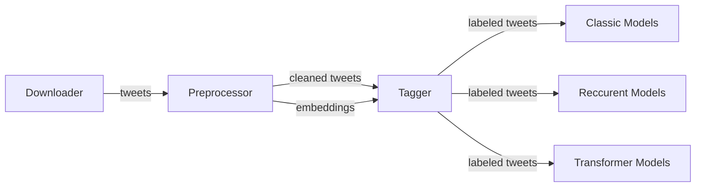
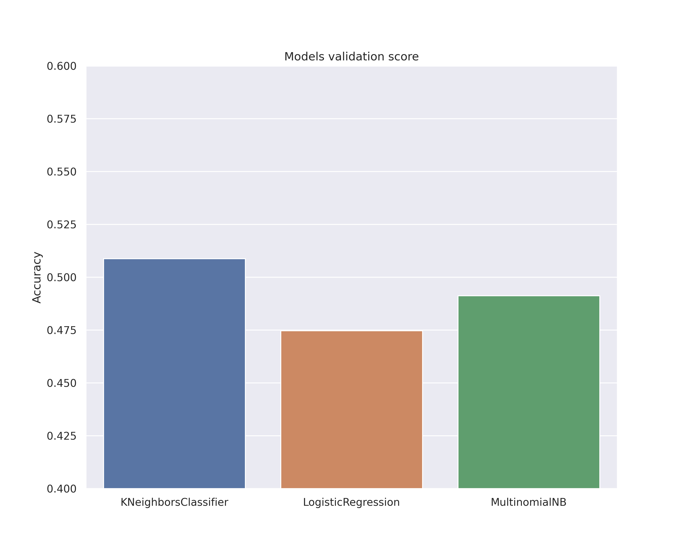

# Semantic analysis
Simple university project showcasing **sentiment analysis** on collected **tweets**.


## Pipeline




## Downloader

Use `downloader.py` script to download tweets from *users* specified in text file. Output file will be in CSV format.

Below is an exact command used to generate `resources\downloader\tweets.csv` file:

```shell
python downloader.py \
--tweets 10000 \
--users resources/downloader/users.txt \
--output resources/downloader/tweets.csv \
--verbose
```

## Preprocessor & Tagger

Use `preprocessor.py` and `tagger.py` scripts to normalize and label tweets. 

### Normalization
We do the basic stuff:
- remove stop words
- remove punctuation
- remove numbers
- remove emails
- remove url
- remove user tags
- remove hashtags

After the normalization we take only tweets that have more than **20 tokens**.

### Tagging

1. First tweets are tokenized and embedded (vectors of size 3000) via spacy library.
2. Then we create second embeddings (vectors of size 4) by using [sentiment dictionary](http://zil.ipipan.waw.pl/SlownikWydzwieku) provided by IPIPAN. 
3. Thirdly we combine the two. We reduce the dimensionality of spacy embeddings from 300 to 20 (using PCA) and concatenate those with sentiment embeddings.
4. Finally, we label combined embeddings (vectors of size 24) using KMeans clustering.

<span style="color:#d24343">
Unfortunately the clustering didn't really go two well. The classes seemed a bit random, and it is reflected in the achieved scores. 
Hand labeling at least a part of dataset would probably help a lot, but I really didn't have time for that :( 
</span>

## Classic Models

Use `classic.py` script to train, validate and test three models:
- LogisticRegression
- KNeighborsClassifier
- MultinomialNB

We train and validate all three, then pick the best one for testing.


