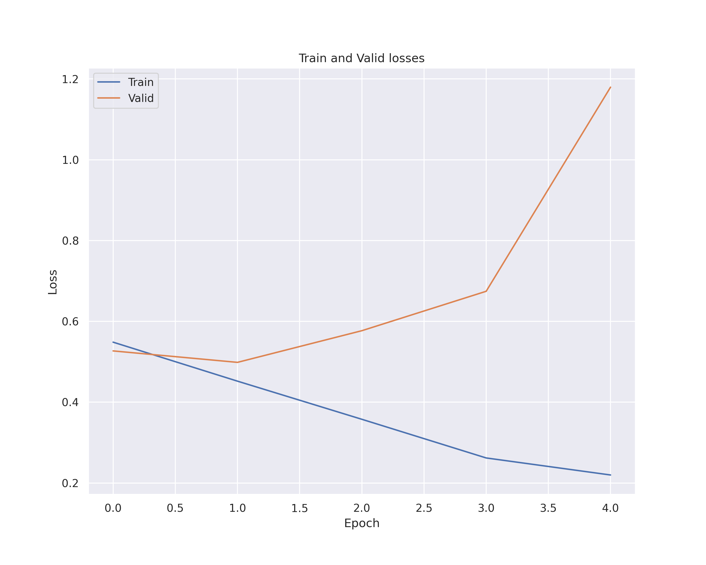

# Semantic analysis
Simple university project showcasing **sentiment analysis** on collected **tweets**.


## Pipeline


## Setup

```bash
python -m virtualenv venv
source ./venv/bin/activate
pip install -r requirements.txt
```


## Downloader

Use `downloader.py` script to download tweets from *users* specified in text file. Output file will be in CSV format.

Below is an exact command used to generate `resources\downloader\tweets.csv` file:

```shell
python downloader.py \
--tweets 10000 \
--users resources/downloader/users.txt \
--output resources/downloader/tweets.csv \
--verbose
```

## Preprocessor & Tagger

Use `preprocessor.py` and `tagger.py` scripts to normalize and label tweets. 

### Normalization
We do the basic stuff:
- remove stop words
- remove punctuation
- remove numbers
- remove emails
- remove url
- remove user tags
- remove hashtags

After the normalization we take only tweets that have more than **20 tokens**.

### Tagging

1. First tweets are tokenized and embedded (vectors of size 3000) via spacy library.
2. Then we create second embeddings (vectors of size 4) by using [sentiment dictionary](http://zil.ipipan.waw.pl/SlownikWydzwieku) provided by IPIPAN. 
3. Thirdly we combine the two. We reduce the dimensionality of spacy embeddings from 300 to 20 (using PCA) and concatenate those with sentiment embeddings.
4. Finally, we label combined embeddings (vectors of size 24) using KMeans clustering.

The embedding files are too big for GitHub and are not included in repository. The csv files are in `resources/tagger` folder.

##### Note

**Unfortunately the clustering didn't really go too well. The classes seemed a bit random, and it is reflected in the achieved scores. 
Hand labeling at least a part of dataset would probably help a lot, but I really didn't have time for that :(**


## Classic Models

Use `classic.py` script to train, validate and test three models:
- LogisticRegression
- KNeighborsClassifier
- MultinomialNB

We train and validate all three, then pick the best one for testing. Below we provide:
- Validation scores for all three models
- Confusion Matrix and Roc Curve for KNeighborsClassifier on test data
- Full classification report for KNeighborsClassifier on test data


<table>
 <tr>
    <td></td>
    <td></td>
 </tr>
</table>

```
              precision    recall  f1-score   support

    Negative       0.44      0.43      0.43      1514
    Positive       0.54      0.55      0.55      1822

    accuracy                           0.50      3336
   macro avg       0.49      0.49      0.49      3336
weighted avg       0.49      0.50      0.49      3336
```

As we can see classic models did really poorly.

## Recurrent Models

We test two recurrent model, LSTM-based and GRU-based. During training, we select model with the best validation score. 
Below we provide:
- Train and validation losses
- Confusion Matrices on test data
- Classification reports on test 


<table>
 <tr>
    <td>GRU</td>
    <td>LSTM</td>
 </tr>
 <tr>
    <td></td>
    <td></td>
 </tr>
 <tr>
    <td></td>
    <td></td>
 </tr>
</table>


#### GRU Report
```
              precision    recall  f1-score   support

    Negative       0.66      0.67      0.66      1514
    Positive       0.72      0.72      0.72      1822

    accuracy                           0.70      3336
   macro avg       0.69      0.69      0.69      3336
weighted avg       0.70      0.70      0.70      3336
```

#### LSTM Report
```
              precision    recall  f1-score   support

    Negative       0.66      0.69      0.68      1514
    Positive       0.73      0.71      0.72      1822

    accuracy                           0.70      3336
   macro avg       0.70      0.70      0.70      3336
weighted avg       0.70      0.70      0.70      3336
```


Recurrent models did a bit better. 
However looking at validation losses, we can clearly see how the model cannot generalize.
This is caused most likely by lackluster tagging.

## Transformers

We use [allegro/herbert-base-cased](https://huggingface.co/allegro/herbert-base-cased) BERT based model. 
The script is in notebook form (see `transformer.ipynb`) because computing locally on CPU takes too long.
During training, we select model with the best validation score.

Below we provide:
- Train and validation losses
- Confusion Matrices on test data
- Classification reports on test 




```
              precision    recall  f1-score   support

    Negative       0.72      0.71      0.72      1514
    Positive       0.76      0.77      0.77      1822

    accuracy                           0.74      3336
   macro avg       0.74      0.74      0.74      3336
weighted avg       0.74      0.74      0.74      3336
```

The transformer model did unsurprisingly the best. Still, looking at train and validation losses graph we see lack of generalization.
Again, this should be fixed with better tagging heuristic.
